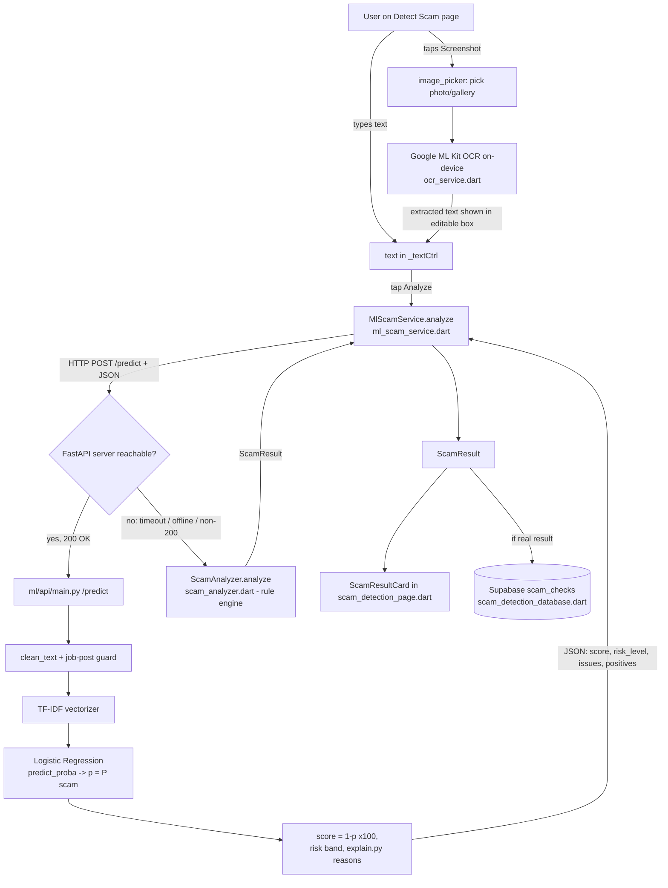

# TrustHire — Project Understanding Guide

> A from-scratch, beginner-friendly teaching document for the ML + OCR scam-detection
> feature. Written for a strong Flutter developer who is **new to machine learning,
> Python, and inference servers**. Every jargon term is defined the first time it appears.
>
> Everything below was written by **reading the actual files** — real
> `path/file:line` references are given so you can click and follow along. Where
> something is a stub, half-finished, or risky, it is called out honestly.

---

## Table of contents

1. [Executive summary](#1-executive-summary)
2. [The big-picture diagram](#2-the-big-picture-diagram)
3. [Chronological walkthrough (M0 → M11)](#3-chronological-walkthrough-m0--m11)
4. [File-by-file reference](#4-file-by-file-reference)
5. [Library-by-library reference](#5-library-by-library-reference)
6. [ML concepts, explained simply](#6-ml-concepts-explained-simply)
7. [The Flutter ↔ API contract](#7-the-flutter--api-contract)
8. [How to run it yourself](#8-how-to-run-it-yourself)
9. [Glossary](#9-glossary)
10. [What's left & open questions](#10-whats-left--open-questions)
11. [Self-check quiz](#11-self-check-quiz)

---

## 1. Executive summary

TrustHire lets a user check whether a job offer is a scam. They either **paste the
text** of an offer or **upload a screenshot** of one (e.g. a WhatsApp or email
message). If it is a screenshot, the phone reads the words out of the image with
**on-device OCR** (Optical Character Recognition — turning picture-of-text back into
editable text). Either way the app ends up with a plain text string, which it sends
over HTTP to a small **Python server** (`ml/api/main.py`). That server runs a
**trained machine-learning model** — it learned from ~17,880 real labelled job ads
which wording tends to be fraudulent — and returns a safety score (0–100), a risk
level (Low / Medium / High), and human-readable reasons. The app shows this in the
existing result card. If the server is unreachable, the app **silently falls back**
to the original hand-written rule engine that already lived in the app, so the
feature never hard-fails.

---

## 2. The big-picture diagram

Both input paths (typed text and screenshot) converge on **one plain text string**,
which takes **one of two routes**: the ML API (preferred) or the offline rule engine
(fallback).



Plain-language version of the same flow:

```
 TYPED TEXT ─┐
             ├─►  one text string  ─►  MlScamService.analyze()
 SCREENSHOT ─┘                              │
   │ image_picker                           │  POST /predict  (HTTP, JSON)
   ▼                                        ▼
 ML Kit OCR ─► editable text box      ┌── server UP ───────────────┐
                                      │  clean_text + job guard    │
                                      │  TF-IDF ► LogReg ► p=P(scam)│
                                      │  score=(1-p)*100, reasons  │
                                      └──────────┬─────────────────┘
                                                 │ JSON back
                            server DOWN/timeout  │
                                 ▼               ▼
                     ScamAnalyzer (rule engine)  ScamResult
                                 └──────┬────────┘
                                        ▼
                              ScamResultCard  +  Supabase scam_checks
```

The **fallback** is the key reliability design: it lives in
[`ml_scam_service.dart:58-66`](../lib/Pages/scam_detection/ml_scam_service.dart#L58-L66).
Any failure — timeout, socket error, non-200 status, bad JSON — routes to the
on-device `ScamAnalyzer`. That is why the old rule engine is **kept, not deleted**.

---

## 3. Chronological walkthrough (M0 → M11)

This is the order things were built. Each stage produces files the next stage
consumes. A few milestone numbers (M0, M9, M10) are **not literally tagged in the
code** — only M2–M8 and M11 carry explicit `"""M# — ..."""` headers in their
docstrings. Where a number is inferred from the artifacts, it is marked *(inferred)*.

### M0 — Project scaffold *(inferred)*
**What:** Set up the isolated Python workspace and the shared plumbing every later
script depends on. **Why it mattered:** guarantees reproducibility (one fixed random
seed, pinned library versions) and that *all* stages clean text identically — if the
server cleaned text differently from how the model was trained, predictions silently
rot (a classic ML bug, called out at [`common.py:1-7`](../ml/src/common.py#L1-L7)).
**Files created:** [`ml/README.md`](../ml/README.md),
[`ml/requirements.txt`](../ml/requirements.txt),
[`ml/requirements-distilbert.txt`](../ml/requirements-distilbert.txt),
[`ml/src/common.py`](../ml/src/common.py) (paths, `RANDOM_STATE = 42`, the two
text-cleaning functions). **Key result:** a runnable, version-pinned pipeline skeleton.

### M1 — Dataset acquisition
**What:** Download **EMSCAD** (Employment Scam Aegean Dataset) — ~17,880 real job ads,
each labelled `fraudulent` = 1 or 0 — and drop it at `ml/data/fake_job_postings.csv`.
**Why it mattered:** machine learning *learns from examples*; without labelled data
there is nothing to learn from. **Files:** the CSV (git-ignored). **Key result:** the
raw material; ~4.84% of rows are scams (a strong **class imbalance**, explained in §6).

### M2 — Data preparation
**What:** [`ml/src/prepare_data.py`](../ml/src/prepare_data.py) merges the free-text
columns (title, company_profile, description, requirements, benefits —
[`common.py:36-42`](../ml/src/common.py#L36-L42)) into one document per posting,
cleans it two ways, and does a **stratified 80/20 train/test split** with a fixed seed.
**Why it mattered:** you must judge a model on data it has **never seen** during
training — otherwise it's like grading students on the exact questions whose answers
you gave them ([`prepare_data.py:12-22`](../ml/src/prepare_data.py#L12-L22)).
*Stratify* keeps the rare ~4.84% scam rate identical in both halves so the metrics
aren't accidentally meaningless. **Files created:** `data/train.csv`, `data/test.csv`
(columns: `text`, `raw_text`, `label`). **Key result:** 14,304 train rows / 3,576 test
rows, each split holding the same scam proportion.

### M3 — Rule-engine baseline (the bar to beat)
**What:** [`ml/src/rule_baseline.py`](../ml/src/rule_baseline.py) is a faithful Python
port of the app's existing Dart rule engine, run on the **same** test set. **Why it
mattered:** in research you never report a score in a vacuum — "0.9 compared to
*what*?" The honest question is "is ML actually better than the rules we already
had?", so you run the rules on the identical test set
([`rule_baseline.py:9-13`](../ml/src/rule_baseline.py#L9-L13)). **Key result:**
**F1 = 0.049, ROC-AUC = 0.550** (barely above 0.5 = random guessing). This is the bar
the ML model must clear. **Why so low?** The hand-written rules were designed for
crude consumer scams ("pay a bitcoin fee!!"), but EMSCAD is full of *polished
corporate fakes* that don't use those words — so the rules catch almost nothing
(recall 0.035 = it found 6 of 173 scams).

### M4 — Classical ML models (the model we shipped)
**What:** [`ml/src/train_classical.py`](../ml/src/train_classical.py) converts text to
numbers with **TF-IDF**, then trains three standard text classifiers — **Logistic
Regression**, **Multinomial Naive Bayes**, and a probability-calibrated **Linear SVM**
— and saves all of them. **Why it mattered:** these train in *seconds* on a normal
laptop CPU and give a strong, interpretable reference before reaching for a heavy
transformer. **Key results** (from
[`model_meta.json`](../ml/models/model_meta.json)):

| Model | F1 | ROC-AUC |
|---|---|---|
| Logistic Regression *(deployed)* | **0.867** | 0.990 |
| Multinomial Naive Bayes | 0.492 | 0.921 |
| Linear SVM *(highest F1)* | 0.910 | 0.992 |

**Why did F1 jump from 0.049 → 0.867?** The rules only know ~30 hand-picked phrases.
TF-IDF + Logistic Regression instead *learns a weight for every one of up to 50,000
word/word-pair features* directly from thousands of real labelled scams — it discovers
whatever wording actually separates scam from legit in this data, instead of relying
on a human's guess list. That is the whole point of the project.
**Note:** the SVM scores *slightly higher* F1, but **Logistic Regression is the
deployed model** ([`train_classical.py:58-62`](../ml/src/train_classical.py#L58-L62))
because it is **interpretable** — its per-word weights directly produce the "why"
shown to the user (see M6) — and the two are essentially tied.

### M5 — Evaluation & baseline comparison
**What:** [`ml/src/evaluate.py`](../ml/src/evaluate.py) produces the headline research
artifact: a like-for-like metrics table (rule vs ML), a **confusion matrix** plot, an
**ROC-curve** plot overlaying both, and a **threshold sweep**. **Why it mattered:**
this is the evidence that ML beat the baseline, and it shows the precision/recall
trade-off you can dial with the threshold. **Files created:**
[`reports/metrics.json`](../ml/reports/metrics.json),
[`reports/comparison.md`](../ml/reports/comparison.md),
`reports/confusion_matrix_ml.png`, `reports/roc_curves.png`. **Key result** (deployed
LogReg @ threshold 0.5): precision 0.831, recall 0.908, F1 0.867, ROC-AUC 0.990;
confusion matrix TN=3371, FP=32, FN=16, TP=157 — i.e. it *missed only 16 of 173
scams*. The sweep also notes threshold **0.6 maximises F1 at 0.900** on this test set.

### M6 — Explainability
**What:** [`ml/src/explain.py`](../ml/src/explain.py) opens the model's "black box":
for one posting it lists the **top words pushing toward scam** and **toward legit**.
**Why it mattered:** a detector that says "73% risky" with no reason is untrustworthy;
the old rules always told you *which* red flags fired, and this keeps that property.
**How:** Logistic Regression is, under the hood, a weighted sum
`score = w1·term1 + w2·term2 + … + bias`. A positive weight pushes toward scam. For a
given post, each present term's contribution = its TF-IDF value × its learned weight;
the biggest contributors become the reasons
([`explain.py:55-67`](../ml/src/explain.py#L55-L67)). This is *honest* — it is
literally what drove the decision. **Key result:** `to_reasons()` produces the
`issues` / `positives` lists the existing UI card already expects.

### M7 — DistilBERT, the transformer upgrade *(optional; did NOT win)*
**What:** [`ml/src/train_distilbert.py`](../ml/src/train_distilbert.py) fine-tunes
**DistilBERT** (a small pre-trained language model that reads words *in context*,
unlike bag-of-words TF-IDF) and evaluates it on the same test set. **Why attempted:**
TF-IDF can't tell that "no fee required" and "fee required" mean opposite things —
word order is lost; a transformer can. **Key result** (from
[`distilbert_metrics.json`](../ml/reports/distilbert_metrics.json)): **F1 = 0.662**,
precision 0.545, recall 0.844, ROC-AUC 0.980 — i.e. it **lost to the classical
model's 0.867**. Why? It was trained on a CPU with the data **down-sampled** to 2,772
rows for only 2 epochs ([`train_distilbert.py:22-27`](../ml/src/train_distilbert.py#L22-L27)),
which handicaps it; and the classical model was already very strong. Reporting a
*negative* result honestly is itself valid research. **It is not served by the API** —
the shipped model stays Logistic Regression.

### M8 — Inference API (FastAPI)
**What:** [`ml/api/main.py`](../ml/api/main.py) is a tiny HTTP server that loads
`model.joblib` **once at startup** and answers `POST /predict` with the exact result
shape the Flutter card renders. **Why it mattered:** scikit-learn pipelines don't
convert cleanly to a phone runtime (TFLite), and a server lets you swap the model
later without shipping a new app build. **Key result:** the bridge between Python ML
and the Flutter app; `score = (1 − p) × 100`, risk banded High ≥ 0.5 / Medium ≥ 0.30 /
else Low ([`main.py:61-85`](../ml/api/main.py#L61-L85)).

### M9 — Flutter ML integration *(inferred)*
**What:** [`lib/Pages/scam_detection/ml_scam_service.dart`](../lib/Pages/scam_detection/ml_scam_service.dart)
calls the API, maps the JSON to the existing `ScamResult`, and **falls back** to the
rule engine on any error; [`lib/Utilities/Constants/api_config.dart`](../lib/Utilities/Constants/api_config.dart)
picks the right server URL per platform (emulator vs simulator vs physical phone).
**Why it mattered:** wires the model into the app without changing the UI card or
Supabase storage, and guarantees the feature never hard-fails. **Key result:** the
Detect Scam page now uses ML with a transparent offline safety net.

### M10 — Screenshot OCR feature *(inferred)*
**What:** [`lib/Pages/scam_detection/ocr_service.dart`](../lib/Pages/scam_detection/ocr_service.dart)
adds image pick + on-device OCR; the Detect Scam page
([`scam_detection_page.dart`](../lib/Pages/scam_detection/scam_detection_page.dart))
gains a Screenshot mode that drops the recognised text into the **same** controller
the paste box uses, so a screenshot flows through the **identical** ML path as typed
text. **Why it mattered:** lets users scan a WhatsApp/email screenshot instead of
retyping it. **Key result:** OCR text shown in an editable box (so the user can fix
recognition mistakes) before analysis.

### M11 — Final PDF report
**What:** [`ml/src/generate_report.py`](../ml/src/generate_report.py) assembles a
self-contained PDF (problem → architecture → ML process → evaluation → OCR →
deployment → tools → limitations → reproducibility), reading **every number from the
generated JSON artifacts** so the report can never disagree with the code. **Key
result:** [`ml/reports/TrustHire_Report.pdf`](../ml/reports/TrustHire_Report.pdf).

---

## 4. File-by-file reference

### Python — `ml/`

#### `ml/README.md`
One-line purpose: human onboarding doc for the ML side. Exists so a newcomer can run
the whole pipeline top-to-bottom. **Note an inconsistency to be aware of:** the setup
section says "pinned to Python 3.12" ([`README.md:43-44`](../ml/README.md#L43)) but
`requirements.txt` and the actual virtual-env (`__pycache__` files are `cpython-314`)
use **Python 3.14**. The 3.14 statements reflect reality; the "3.12" line is stale.

#### `ml/requirements.txt`
Core pinned dependencies (numpy, pandas, scipy, scikit-learn, joblib, matplotlib,
fastapi, uvicorn, pydantic, reportlab). Exists so anyone re-running the project gets
the same versions and the same numbers. CPU-only, no GPU needed.

#### `ml/requirements-distilbert.txt`
Heavy optional deps (torch, transformers, datasets, accelerate) for M7 only. Kept
separate so the core install stays small/fast. The file itself documents that if a
CPU `torch` wheel doesn't exist for the Python version, skipping M7 is a valid outcome.

#### `ml/src/common.py`
One-line purpose: shared constants + the two text-cleaning functions every stage uses.
Why it exists: so data prep, training, evaluation, and the API clean text **identically**.
- `RANDOM_STATE = 42` ([:18](../ml/src/common.py#L18)) — the single seed making every
  split/model reproducible.
- Path constants (`ML_DIR`, `DATA_DIR`, `MODELS_DIR`, `REPORTS_DIR`, `RAW_CSV`,
  `TRAIN_CSV`, `TEST_CSV`) ([:24-31](../ml/src/common.py#L24-L31)) — absolute paths so
  scripts work from any directory.
- `TEXT_COLUMNS`, `LABEL_COLUMN` ([:36-45](../ml/src/common.py#L36-L45)) — which CSV
  columns are merged into the document, and which is the 0/1 label.
- `clean_text(text)` ([:55](../ml/src/common.py#L55)) — cleaning **for the model**:
  strip HTML and EMSCAD `#URL_...#` placeholders, lowercase, collapse whitespace.
  Deliberately gentle so it doesn't delete scam signal.
- `light_clean_keepcase(text)` ([:72](../ml/src/common.py#L72)) — cleaning **for the
  rule baseline**: keeps case + punctuation (the rules inspect ALL-CAPS and `!!`).
- `ensure_dir(path)` ([:88](../ml/src/common.py#L88)) — mkdir-if-missing helper.

**Who calls it:** everything — `prepare_data`, `train_classical`, `evaluate`,
`explain`, `train_distilbert`, `generate_report`, and `api/main.py` all import from it.

#### `ml/src/prepare_data.py` (M2)
One-line purpose: build the cleaned, stratified train/test CSVs from the raw dataset.
- `main()` — loads `fake_job_postings.csv`, checks the expected columns exist, merges
  text columns ([:68-70](../ml/src/prepare_data.py#L68-L70)), creates two views
  (`text` for the model via `clean_text`, `raw_text` for the rules via
  `light_clean_keepcase`), drops empty rows, prints class balance, then
  `train_test_split(..., test_size=0.20, stratify=df["label"])`
  ([:96-101](../ml/src/prepare_data.py#L96-L101)) and writes the CSVs.

**Connects to:** consumes the raw CSV; produces what `rule_baseline`, `train_classical`,
`evaluate`, and `train_distilbert` all read.

#### `ml/src/rule_baseline.py` (M3)
One-line purpose: the scientific control — the Dart rule engine ported to Python.
- `RuleResult` dataclass ([:36-41](../ml/src/rule_baseline.py#L36)) — mirrors the Dart
  `ScamResult` (score, risk_level, issues, positives).
- `analyze(input_text)` ([:48](../ml/src/rule_baseline.py#L48)) — line-for-line port of
  `ScamAnalyzer.analyze()`: starts at score 100, subtracts penalties for red-flag
  phrases (upfront payment −35, untraceable payment −30, etc.), adds positives, bands
  the risk. Uses raw (case-preserved) text for the ALL-CAPS check.
- `scam_proba(input_text)` ([:153](../ml/src/rule_baseline.py#L153)) — converts the
  0–100 score to a scam probability `(100 − score)/100` so it can be compared/ROC'd
  against the ML model.
- `main()` — runs the baseline on `test.csv` and prints accuracy/precision/recall/F1/
  ROC-AUC + confusion matrix.

**Connects to:** `evaluate.py` imports `scam_proba` as `rule_scam_proba` to draw the
rule ROC curve next to the ML one.

#### `ml/src/train_classical.py` (M4)
One-line purpose: train + save the three classical models and pick the deployed one.
- `DEPLOY_MODEL = "logreg"` ([:62](../ml/src/train_classical.py#L62)) — which model the
  app ships (LogReg, for interpretability).
- `build_vectorizer()` ([:65](../ml/src/train_classical.py#L65)) — one shared TF-IDF
  config (English stopwords removed, unigrams+bigrams, min_df=5, max 50k features,
  sublinear TF) so all models are compared fairly.
- `candidate_models()` ([:76](../ml/src/train_classical.py#L76)) — the three classifiers;
  LogReg & SVM use `class_weight="balanced"`; the SVM is wrapped in
  `CalibratedClassifierCV` so it can output probabilities.
- `main()` — for each model builds a `Pipeline([tfidf, clf])`, fits on train, scores on
  test, saves each as `model_<name>.joblib`, copies the deployed one to `model.joblib`,
  and writes `model_meta.json` (deployed model, threshold, per-model F1/AUC).

**Connects to:** produces `models/*.joblib` + `model_meta.json` consumed by
`evaluate.py`, `explain.py`, and `api/main.py`.

#### `ml/src/evaluate.py` (M5)
One-line purpose: the headline comparison (rule vs ML) + plots + threshold sweep.
- `metrics_at(y_true, proba, threshold)` ([:52](../ml/src/evaluate.py#L52)) — turns
  probabilities into a 0/1 decision at a threshold and computes the full metric set +
  confusion-matrix counts.
- `main()` — loads `model.joblib`, gets ML probabilities and rule probabilities on the
  test set, prints the comparison table, sweeps thresholds 0.1–0.9, and writes
  `metrics.json`, `comparison.md`, `confusion_matrix_ml.png`, `roc_curves.png`.

**Connects to:** reads the trained model + `rule_baseline.scam_proba`; feeds
`generate_report.py`.

#### `ml/src/explain.py` (M6)
One-line purpose: turn the linear model's weights into human-readable reasons.
- `explain(text, pipe, top_k)` ([:39](../ml/src/explain.py#L39)) — multiplies each
  present term's TF-IDF value by its learned weight and returns the top scam-pushing
  and legit-pushing terms (with signed contributions).
- `to_reasons(text, ...)` ([:70](../ml/src/explain.py#L70)) — maps those terms to the
  UI strings `"Scam-associated wording: '…'"` / `"Legitimate-looking wording: '…'"`,
  dropping weak terms below `min_contrib`.
- `main()` — CLI demo: prints scam probability + top terms for a pasted post.

**Connects to:** `api/main.py` imports `to_reasons` to fill `issues`/`positives`.

#### `ml/src/train_distilbert.py` (M7, optional)
One-line purpose: fine-tune DistilBERT as an upgrade experiment.
- `build_training_frame(neg_ratio, full)` ([:62](../ml/src/train_distilbert.py#L62)) —
  optionally down-samples the legit class for fast CPU training.
- `compute_metrics(eval_pred)` ([:76](../ml/src/train_distilbert.py#L76)) — softmax →
  scam probability → metrics, evaluated on the **full** test set.
- `main()` — tokenizes, fine-tunes with Hugging Face `Trainer`, evaluates, saves the
  model + `reports/distilbert_metrics.json`, prints the 3-way comparison.

**Connects to:** standalone; only `generate_report.py` reads its metrics JSON if present.

#### `ml/api/main.py` (M8)
One-line purpose: the FastAPI inference server the app calls.
- Module load ([:57-63](../ml/api/main.py#L57-L63)) — loads `model.joblib` and
  `model_meta.json` **once**; sets `HIGH_T` (0.5), `MED_T` (0.30).
- `_JOB_WORDS` ([:46-55](../ml/api/main.py#L46)) — broad job/scam vocabulary guard
  (mirrors the Dart list) to bounce clearly-unrelated screenshots.
- `PredictRequest` / `PredictResponse` ([:68-77](../ml/api/main.py#L68-L77)) — pydantic
  models defining the JSON in/out shapes.
- `_band(p)` ([:80](../ml/api/main.py#L80)) — probability → risk label.
- `health()` ([:88](../ml/api/main.py#L88)) — `GET /health` liveness probe.
- `predict(req)` ([:93](../ml/api/main.py#L93)) — the core endpoint: clean → guard →
  `predict_proba` → `score = (1−p)*100` → band → `to_reasons` → JSON. On Low Risk it
  drops noisy scam "issues"; on High Risk it drops positives.

**Connects to:** imports `common.clean_text` + `explain.to_reasons`; loads the M4
artifacts; is the HTTP server `ml_scam_service.dart` talks to.

#### `ml/src/generate_report.py` (M11)
One-line purpose: build the final PDF from the generated artifacts.
- `_load()` ([:42](../ml/src/generate_report.py#L42)) — read a JSON if it exists.
- `metric_table()`, `img()`, `h1/h2/p/sp` helpers — reportlab layout building blocks.
- Module body — assembles the `story` (title, problem, architecture diagram, ML
  process, evaluation table + plots, OCR, deployment, tools, ethics, reproducibility)
  and writes `reports/TrustHire_Report.pdf`. Adapts automatically if DistilBERT wasn't
  run.

#### `ml/models/model_meta.json`
One-line purpose: small config the API and report trust. Records `deployed_model`
("logreg"), `best_by_f1` ("linear_svm"), `threshold` (0.5), `random_state` (42), and
per-model F1/AUC. The API reads `threshold` and `deployed_model` from here at startup.

#### Generated artifacts (not source, but referenced)
- `ml/data/train.csv`, `ml/data/test.csv` — the M2 splits.
- `ml/models/model.joblib` — the **deployed** pipeline the API loads.
- `ml/models/model_{logreg,naive_bayes,linear_svm}.joblib` — all three saved models.
- `ml/reports/metrics.json`, `comparison.md`, `*.png` — M5 outputs.
- `ml/reports/distilbert_metrics.json` — M7 output.
- `ml/reports/TrustHire_Report.pdf` — M11 output.

### Dart — `lib/Pages/scam_detection/` (+ `api_config.dart`)

#### `lib/Pages/scam_detection/scam_analyzer.dart`
One-line purpose: the original on-device rule engine **and** the shared `ScamResult`
type. Exists as the offline fallback and as the data shape every layer uses.
- `ScamResult` ([:1-9](../lib/Pages/scam_detection/scam_analyzer.dart#L1-L9)) — score,
  riskLevel, issues, positives. Used by the API mapping, the fallback, the UI card, and
  the DB record.
- `ScamAnalyzer.analyze(input)` ([:13](../lib/Pages/scam_detection/scam_analyzer.dart#L13)) —
  the hand-written keyword/regex rules (the Python `rule_baseline.py` is its twin).

**Connects to:** called by `MlScamService._fallback`; its `ScamResult` is the lingua
franca of the whole feature.

#### `lib/Pages/scam_detection/ml_scam_service.dart` (M9)
One-line purpose: the network client that prefers the ML API and falls back offline.
- `ScamAnalysis` ([:10-18](../lib/Pages/scam_detection/ml_scam_service.dart#L10)) —
  wraps a `ScamResult` plus a `usedFallback` bool so the UI can warn the user.
- `MlScamService.analyze(text)` ([:34](../lib/Pages/scam_detection/ml_scam_service.dart#L34)) —
  `POST /predict` with an 8-second timeout; on 200, maps JSON → `ScamResult`; on
  anything else, calls `_fallback`.
- `_fallback(text)` ([:64](../lib/Pages/scam_detection/ml_scam_service.dart#L64)) — runs
  `ScamAnalyzer.analyze` locally.

**Connects to:** uses `ApiConfig.scamPredictUrl`; called by `scam_detection_page.dart`.

#### `lib/Pages/scam_detection/ocr_service.dart` (M10)
One-line purpose: pick an image and OCR it on-device.
- `pickAndExtract(source)` ([:21](../lib/Pages/scam_detection/ocr_service.dart#L21)) —
  `image_picker` to choose camera/gallery (quality 100), then extract text; returns
  null if the user cancels.
- `_extractText(path)` ([:31](../lib/Pages/scam_detection/ocr_service.dart#L31)) — runs
  Google ML Kit `TextRecognizer` and returns the trimmed text.

**Connects to:** called by `scam_detection_page.dart`'s `_pickAndOcr`; its output goes
into the same `_textCtrl` the paste box uses.

#### `lib/Pages/scam_detection/scam_detection_page.dart` (M10 UI)
One-line purpose: the Detect Scam screen tying paste/screenshot input → analysis → card.
- `_pickAndOcr(source)` ([:34](../lib/Pages/scam_detection/scam_detection_page.dart#L34)) —
  runs OCR and fills `_textCtrl`.
- `_analyze()` ([:96](../lib/Pages/scam_detection/scam_detection_page.dart#L96)) — calls
  `MlScamService.analyze`, shows the result card, warns if fallback was used, and
  persists real results to Supabase (skips guard results).
- `build()` — the UI (banner, Paste/Screenshot toggle, editable OCR box, Analyze
  button, `ScamResultCard`).

**Connects to:** uses `MlScamService`, `OcrService`, `ScamCheckRepository`,
`ScamResultCard`.

#### `lib/Pages/scam_detection/scam_detection_database.dart`
One-line purpose: persist/fetch/delete scam-check history in Supabase.
- `saveResult(...)` ([:17](../lib/Pages/scam_detection/scam_detection_database.dart#L17)) —
  insert a `ScamCheckRecord` for the current user.
- `fetchHistory()` / `deleteRecord(id)` — read/delete the user's rows.

**Connects to:** called by `scam_detection_page._analyze`; uses `ScamCheckRecord`.

#### `lib/Model/scam_check_model.dart`
One-line purpose: the `ScamCheckRecord` data model (DB row ↔ Dart object).
- `toJson()` / `fromJson()` — serialize to/from the Supabase `scam_checks` table
  (user_id, input_text, score, risk_level, issues, positives, created_at).

#### `lib/Utilities/Constants/api_config.dart` (M9)
One-line purpose: choose the correct ML-server base URL for the current platform.
- `kScamApiOverride` ([:28](../lib/Utilities/Constants/api_config.dart#L28)) — manual
  override for a physical phone (`http://YOUR-PC-IP:8000`).
- `scamApiBaseUrl` ([:31](../lib/Utilities/Constants/api_config.dart#L31)) — web/desktop
  → `127.0.0.1`, **Android emulator → `10.0.2.2`** (its alias for the host PC),
  iOS/desktop → `127.0.0.1`.
- `scamPredictUrl` ([:39](../lib/Utilities/Constants/api_config.dart#L39)) — appends
  `/predict`.

**Connects to:** read by `MlScamService.analyze`.

---

## 5. Library-by-library reference

### Python (`ml/`)

| Library | What it is | Job in THIS project | Where used |
|---|---|---|---|
| **numpy** | Fast numeric arrays (the base of Python ML) | Array math behind the scenes; explicit array ops in explainability and DistilBERT | `explain.py`, `train_distilbert.py` (and inside scikit-learn) |
| **pandas** | Tables ("DataFrames") for loading/manipulating CSV data | Read the dataset, merge text columns, build train/test frames | `prepare_data.py`, `train_classical.py`, `evaluate.py`, `rule_baseline.py`, `train_distilbert.py` |
| **scipy** | Scientific computing (sparse matrices, stats) | Underpins TF-IDF's sparse matrices (a dependency of scikit-learn) | indirect (via scikit-learn) |
| **scikit-learn** | The classical-ML toolkit (models, features, metrics) | TF-IDF, Logistic Regression / Naive Bayes / SVM, the train/test split, all metrics, the Pipeline | `train_classical.py`, `evaluate.py`, `prepare_data.py`, `rule_baseline.py` |
| **joblib** | Save/load Python objects to disk efficiently | Persist the trained pipelines as `.joblib`; the API loads `model.joblib` | `train_classical.py`, `evaluate.py`, `explain.py`, `api/main.py` |
| **matplotlib** | Plotting library | Render the confusion-matrix and ROC-curve PNGs | `evaluate.py` |
| **fastapi** | Modern Python web framework for APIs | Defines the `/predict` and `/health` HTTP endpoints | `api/main.py` |
| **uvicorn** | ASGI web server | Actually runs the FastAPI app (`uvicorn api.main:app`) | run command (serves `api/main.py`) |
| **pydantic** | Data validation via typed models | Defines/validates `PredictRequest` and `PredictResponse` JSON shapes | `api/main.py` |
| **reportlab** | PDF generation | Build the final `TrustHire_Report.pdf` | `generate_report.py` |
| **torch** (optional) | Deep-learning framework (PyTorch) | Tensors + softmax for DistilBERT; runs the transformer | `train_distilbert.py` |
| **transformers** (optional) | Hugging Face pre-trained models | DistilBERT model, tokenizer, `Trainer` | `train_distilbert.py` |
| **datasets** (optional) | Hugging Face data wrapper | Wrap the DataFrame for the `Trainer` | `train_distilbert.py` |
| **accelerate** (optional) | Training launcher/optimizer for transformers | Backs the Hugging Face `Trainer` | `train_distilbert.py` (indirect) |

### Flutter (`lib/`)

| Package | What it is | Job in THIS project | Where used |
|---|---|---|---|
| **http** | HTTP client for Dart | `POST /predict` to the ML API and read the JSON response | `ml_scam_service.dart` |
| **image_picker** | Pick photos from camera/gallery | Let the user choose a screenshot to OCR | `ocr_service.dart`, `scam_detection_page.dart` |
| **google_mlkit_text_recognition** | Google ML Kit on-device OCR | Turn the screenshot's pixels into editable text | `ocr_service.dart` |
| **supabase_flutter** | Supabase client | Store/fetch scam-check history | `scam_detection_database.dart` |

---

## 6. ML concepts, explained simply

**Inference** — using a *trained* model to make a prediction on new input (as opposed
to *training*, which is the one-time learning phase). The API does inference.

**TF-IDF (Term Frequency–Inverse Document Frequency)** — turns text into numbers a
model can do math on. Each posting becomes a long list (vector) of word scores. A word
scores high if it appears a lot **in this posting** (term frequency) but is rare
**across all postings** (inverse document frequency). So filler like "the/and/job"
fades to near-zero while distinctive words like "fee", "wire", "bonus" stand out. It is
a *data-driven* version of the old keyword lists — but the importance of each word is
**learned from data**, not hand-set. Config used: unigrams + bigrams (single words and
two-word phrases like "wire transfer"), English stopwords removed, up to 50,000
features ([`train_classical.py:65-73`](../ml/src/train_classical.py#L65-L73)).

**Logistic regression** — despite "regression" in the name, it's a **classifier**. It
learns one weight per feature (word/word-pair), multiplies each posting's TF-IDF values
by those weights, sums them, and squashes the result through an S-curve into a
probability between 0 and 1. Positive-weight words push the probability toward "scam";
negative-weight words push it toward "legit". Because it's just a weighted sum, you can
read off *exactly why* it decided — that's what M6 (`explain.py`) exploits, and the
reason it's the deployed model over the slightly-better SVM.

**`predict_proba`** — the scikit-learn method that returns a **probability**, not just
a yes/no. `predict_proba([...])[0, 1]` is `p = P(scam)` for the first input. The API
uses this so it can show a graded 0–100 score, not just a binary label
([`api/main.py:113`](../ml/api/main.py#L113)).

**Decision threshold** — the cut-off that turns the probability `p` into a yes/no.
`threshold = 0.5` in [`model_meta.json`](../ml/models/model_meta.json) means "if
p ≥ 0.5, call it scam." **Lower the threshold → catch more scams (higher recall) but
more false alarms; raise it → fewer false alarms but more missed scams.** The API also
adds a Medium band at 0.30 ([`api/main.py:61-62`](../ml/api/main.py#L61-L62)). The M5
sweep found 0.6 maximises F1 on the test set, but the shipped value stays 0.5.

**Train/test split** — train on one 80% chunk, judge on the held-out 20% the model
never saw. The only honest estimate of real-world behaviour. **Stratified** = the
rare scam rate is kept identical in both halves.

**Class imbalance (4.84% scam)** — only ~1 in 21 postings is a scam. This is
*dangerous* because a lazy model can score **95% accuracy by always saying "legit"** —
and catch **zero** scams. That's why (a) accuracy is a misleading metric here, and (b)
training uses `class_weight="balanced"` to tell the model "a scam mistake matters ~20×
more than a legit mistake" ([`train_classical.py:26-29`](../ml/src/train_classical.py#L26-L29)).

**Precision / Recall / F1 / ROC-AUC** — for THIS app, frame it as *a missed scam is
worse than a false alarm* (a missed scam can cost a job-seeker money; a false alarm
just annoys them).
- **Precision** — of the posts we flagged as scam, how many really were? Low precision
  = lots of false alarms. (ML: 0.831.)
- **Recall** — of the *real* scams, how many did we catch? Low recall = dangerous
  misses. (ML: 0.908 — caught 157 of 173.)
- **F1** — the harmonic mean of precision and recall; one honest number that punishes
  ignoring either. (ML: 0.867 vs rule baseline 0.049.)
- **ROC-AUC** — how well the *score ranks* scams above legit across **all** thresholds
  (1.0 = perfect, 0.5 = coin flip). It's threshold-independent. (ML: 0.990 vs rule
  0.550.)

**Confusion matrix** — the 2×2 tally of TN/FP/FN/TP. For the deployed model:
TN=3371 (legit correctly cleared), FP=32 (false alarms), FN=16 (**missed scams** — the
costly box), TP=157 (scams caught).

---

## 7. The Flutter ↔ API contract

### Request (Flutter → server)
`POST {baseUrl}/predict`, header `Content-Type: application/json`, body:
```json
{ "text": "Congratulations! Pay a registration fee via bitcoin to start..." }
```
Sent by [`ml_scam_service.dart:36-42`](../lib/Pages/scam_detection/ml_scam_service.dart#L36-L42);
shape enforced server-side by `PredictRequest`
([`api/main.py:68-69`](../ml/api/main.py#L68-L69)).

### Response (server → Flutter)
```json
{
  "score": 12,
  "risk_level": "High Risk",
  "issues": ["Scam-associated wording: 'fee'", "Scam-associated wording: 'bitcoin'"],
  "positives": [],
  "scam_probability": 0.88
}
```
Produced by `predict()` ([`api/main.py:93-131`](../ml/api/main.py#L93-L131)). `score`
= `(1 − p) × 100`; `risk_level` is High ≥ 0.5 / Medium ≥ 0.30 / else Low; `issues` and
`positives` come from `explain.to_reasons`; `scam_probability` is debug-only and the UI
ignores it. A non-job-post returns `score 0`, `risk_level "Not Enough Info"`.

### Mapping JSON → `ScamResult`
[`ml_scam_service.dart:51-57`](../lib/Pages/scam_detection/ml_scam_service.dart#L51-L57)
reads `score`, `risk_level`, `issues`, `positives` into the existing `ScamResult`
constructor — the extra `scam_probability` is simply not read. Result is wrapped in
`ScamAnalysis(result, usedFallback: false)`.

### The offline fallback
If the `POST` throws (timeout/socket/bad JSON) **or** returns a non-200 status,
`analyze()` calls `_fallback()`
([`ml_scam_service.dart:44-66`](../lib/Pages/scam_detection/ml_scam_service.dart#L44-L66)),
which runs `ScamAnalyzer.analyze(text)` **on-device** and returns
`usedFallback: true`. The page then shows *"Scam server unavailable — used the offline
detector."* ([`scam_detection_page.dart:117-121`](../lib/Pages/scam_detection/scam_detection_page.dart#L117-L121)).
Because the rule engine returns the same `ScamResult` type, the UI card is identical
either way.

### Picking the server URL (emulator vs simulator vs phone)
[`api_config.dart:31-36`](../lib/Utilities/Constants/api_config.dart#L31-L36):
- **Web / desktop (Windows, macOS, Linux) / iOS simulator** → `http://127.0.0.1:8000`
  (the simulator/desktop shares the host's localhost).
- **Android emulator** → `http://10.0.2.2:8000` — the emulator runs in its own virtual
  machine, so `127.0.0.1` would mean *the emulator itself*; `10.0.2.2` is its special
  alias for **the host PC's** localhost.
- **Physical phone** → set `kScamApiOverride = 'http://<your-PC-LAN-IP>:8000'` (phone
  and PC on the same Wi-Fi); auto-detection can't know your PC's LAN IP.

---

## 8. How to run it yourself

All commands assume **PowerShell**, run from the `ml/` folder unless noted. The
virtual-env already exists at `ml/.venv`.

### 8.1 Activate the environment
```powershell
cd ml
.\.venv\Scripts\Activate.ps1      # prompt should now show (.venv)
```
*Good output:* your prompt is prefixed with `(.venv)`. (If activation is blocked, you
can instead prefix commands with `.\.venv\Scripts\python.exe`.)

### 8.2 Start the API
```powershell
uvicorn api.main:app --reload --port 8000
```
*Good output:* `Uvicorn running on http://127.0.0.1:8000` and `Application startup
complete.` (no traceback). Leave this terminal running.

### 8.3 Test the API in a browser
Open **http://127.0.0.1:8000/docs** — FastAPI's auto-generated interactive page.
Expand `POST /predict`, click *Try it out*, send `{"text": "..."}`. Also try
**http://127.0.0.1:8000/health** → `{"status":"ok","model":"logreg",...}`.

### 8.4 Run the Flutter app against it
In a **separate** terminal at the repo root:
```powershell
flutter run
```
- On the **Android emulator** it auto-targets `10.0.2.2:8000` — no change needed.
- On a **physical phone**, first set `kScamApiOverride` in
  [`api_config.dart`](../lib/Utilities/Constants/api_config.dart) to your PC's LAN IP.
- *Good output:* on the Detect Scam page, analysing a pasted scam shows a High-Risk
  card with word-level reasons; killing the uvicorn server and re-analysing shows the
  *"Scam server unavailable — used the offline detector"* snackbar.

### 8.5 Re-run training / evaluation from scratch (optional)
```powershell
python src/prepare_data.py        # -> data/train.csv, data/test.csv
python src/rule_baseline.py       # baseline metrics (expect F1 ~0.05)
python src/train_classical.py     # -> models/*.joblib  (expect logreg F1 ~0.87)
python src/evaluate.py            # -> reports/ metrics + plots
python src/generate_report.py     # -> reports/TrustHire_Report.pdf
# optional, heavy:
pip install -r requirements-distilbert.txt
python src/train_distilbert.py    # -> reports/distilbert_metrics.json
```
*Good output at each step:* printed metrics matching this guide (LogReg F1 ≈ 0.867),
and freshly written files in `models/` and `reports/`. Re-running gives **identical**
numbers thanks to `random_state = 42`.

> Requires `ml/data/fake_job_postings.csv` to be present for the training steps. Serving
> the API (8.2) does **not** need the raw CSV — it only loads the already-trained
> `models/model.joblib`.

---

## 9. Glossary

- **AUC / ROC-AUC** — area under the ROC curve; how well scores rank scams above legit
  (1.0 perfect, 0.5 random). Threshold-independent.
- **Bigram / unigram** — a two-word phrase / a single word; both used as TF-IDF features.
- **Calibration** — adjusting a model's raw outputs into honest probabilities (the SVM
  needs it via `CalibratedClassifierCV`).
- **Class imbalance** — one label is far rarer than the other (here 4.84% scam).
- **`class_weight="balanced"`** — tells the model rare-class mistakes cost more.
- **Classifier** — a model that predicts a category (scam vs legit).
- **Confusion matrix** — 2×2 counts of TN/FP/FN/TP.
- **DistilBERT** — a small, fast pre-trained transformer language model.
- **Endpoint** — a callable URL on the server (e.g. `/predict`, `/health`).
- **Epoch** — one full pass over the training data during transformer training.
- **F1** — harmonic mean of precision and recall.
- **Fine-tuning** — further-training a pre-trained model on your own labelled data.
- **Inference** — making predictions with a trained model.
- **`joblib`** — saves/loads Python objects (the trained pipeline).
- **Logistic regression** — a linear, interpretable probability classifier.
- **Pipeline** — chained steps (TF-IDF → classifier) saved as one object.
- **Precision** — of flagged scams, how many were real.
- **`predict_proba`** — returns a probability rather than a hard label.
- **Recall** — of real scams, how many were caught.
- **Stratified split** — a split that preserves the class proportions.
- **TF-IDF** — text → numeric word-importance vectors.
- **Threshold** — probability cut-off for the scam/legit decision.
- **Tokenizer** — splits text into model-readable pieces (transformer side).
- **Transformer** — a neural network that reads words in context.
- **Train/test split** — separating learning data from evaluation data.

---

## 10. What's left & open questions

- **M7 (DistilBERT): trained but NOT shipped, and it lost.** F1 0.662 < classical
  0.867. It was deliberately handicapped (CPU, down-sampled to 2,772 rows, 2 epochs) —
  a fair re-run on full data/GPU might be competitive, but that's untested. The API
  **never** serves it; `model.joblib` is always the classical LogReg. Saved weights
  exist under `ml/models/distilbert/` but nothing loads them at runtime.
- **M11 (PDF report): done.** [`ml/reports/TrustHire_Report.pdf`](../ml/reports/TrustHire_Report.pdf)
  exists and is generated from the JSON artifacts, so its numbers can't drift from the
  code.
- **The whole feature depends on a server *you* run locally.** There is no hosted/cloud
  API. For the demo: start uvicorn **before** opening the app, and on a physical phone
  set `kScamApiOverride`. If you forget, the app still works but silently uses the weak
  rule engine (F1 0.049) — verify the snackbar does **not** appear when you expect ML.
- **Python version inconsistency.** `README.md` says "Python 3.12" in one place but the
  env and `requirements.txt` are **3.14**. Harmless, but don't be confused; the running
  env is 3.14.
- **Two parallel rule engines must stay in sync.** `scam_analyzer.dart` (Dart) and
  `rule_baseline.py` (Python) are hand-kept twins, and `_JOB_WORDS` is duplicated in
  `api/main.py` and `scam_analyzer.dart`. If you edit one, edit the other, or the
  offline path and the baseline will diverge. (Minor: the Dart list omits `vacancies`,
  `wfh`, etc. that the Python guard has — a small, already-existing drift.)
- **`models/model_meta.json` says `best_by_f1` = linear_svm (0.910), but deployed =
  logreg (0.867).** This is *intentional* (interpretability), not a bug — but know it,
  because someone may ask "why didn't you ship the best model?"
- **`scam_probability` is returned but unused** by the app — fine, just don't expect it
  in the UI.
- **No automated tests** exist for the ML service or the API in this slice; verification
  is manual (run the app, watch the card and snackbar).

---

## 11. Self-check quiz

Answer these from memory, then check the hidden answers at the bottom.

1. A user uploads a screenshot. List every stage the text passes through before a
   risk score appears.
2. What is the single most important reason the rule engine (`scam_analyzer.dart`) was
   **kept** in the app rather than deleted?
3. Why is **accuracy** a misleading metric for this dataset, and what number makes it
   misleading?
4. The deployed model (LogReg, F1 0.867) is **not** the highest-F1 model. Which is, and
   why did we ship LogReg anyway?
5. What does `predict_proba(...)[0, 1]` return, and how does the API turn it into the
   0–100 `score`?
6. In plain words, what does **TF-IDF** do to a job posting, and why is "the/and/job"
   scored low?
7. Why does the Android emulator use `10.0.2.2` instead of `127.0.0.1`?
8. If you lower the decision threshold from 0.5 to 0.3, what happens to recall and to
   false alarms — and why might that be the right call for a scam detector?
9. Why did DistilBERT (M7) lose to the classical model, and is it served by the API?
10. The rule baseline scored F1 0.049 and the ML model 0.867 on the *same* test set.
    In one sentence, why did the ML model jump so far ahead?

<details>
<summary><b>Answers (click to reveal)</b></summary>

1. Screenshot → `image_picker` (pick) → Google ML Kit OCR (`ocr_service.dart`) →
   editable text box → `_textCtrl` → `MlScamService.analyze` → HTTP `POST /predict` →
   `clean_text` + job-word guard → TF-IDF → Logistic Regression `predict_proba` →
   `score`/risk/reasons → JSON → `ScamResult` → `ScamResultCard` (+ Supabase). If the
   server is down, the rule engine replaces the API step.
2. It's the **offline fallback** — if the ML server is unreachable, the feature must
   never hard-fail, so `MlScamService` runs `ScamAnalyzer` locally instead.
3. ~95% of postings are legitimate (4.84% scam), so a model that always says "legit"
   scores ~95% accuracy while catching **zero** scams. Accuracy hides total failure.
4. The **Linear SVM** (F1 0.910). LogReg was shipped because it is **interpretable** —
   its per-word weights produce the "why" shown to the user — and the two are
   statistically tied.
5. It returns `p = P(scam)`, the probability the post is a scam (between 0 and 1). The
   API computes `score = round((1 − p) × 100)` — a "% safe" score.
6. It converts the post into a vector of word-importance numbers: a word scores high if
   frequent in *this* post but rare *across all* posts. "the/and/job" are everywhere, so
   their inverse-document-frequency is tiny → low score (and stopwords are dropped).
7. The Android emulator runs in its own virtual machine, so `127.0.0.1` means the
   emulator itself; `10.0.2.2` is the emulator's special alias for the **host PC's**
   localhost where uvicorn runs.
8. Recall goes **up** (you catch more scams) and false alarms go **up** too (lower
   precision). For a scam detector a missed scam (costing a job-seeker money) is worse
   than a false alarm (mild annoyance), so accepting more false alarms to miss fewer
   scams can be the right trade.
9. It was trained handicapped on CPU — data down-sampled to 2,772 rows for 2 epochs —
   while the classical model was already very strong; F1 0.662 < 0.867. **No**, the API
   always serves the classical LogReg `model.joblib`.
10. The rules only know ~30 hand-picked phrases tuned for crude consumer scams, while
    TF-IDF + Logistic Regression *learned* weights for up to 50,000 word features from
    thousands of real labelled examples, so it generalises to EMSCAD's polished
    corporate fakes the rules never anticipated.

</details>
